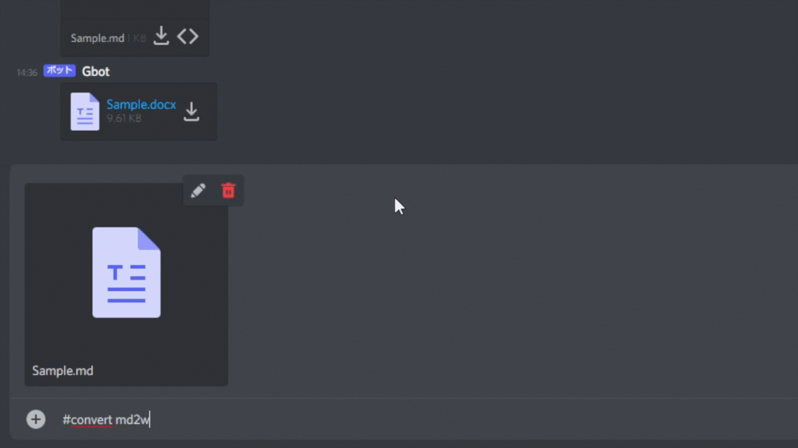

# README

Discord の Bot として以下の機能を追加した。

## 常時稼働機能

### ボイスチャット入退出 log

log ボイスチャットの入退出を log テキストチャット内に表示する。

## コマンド一覧

以下のプログラムは Discord のテキストチャット内で入力するものである。

### シャットダウン

`#shutdown` で Discord Bot を終了する。

### Markdown から PDF へ変換

`#convert word2pdf` でファイルの形式を変換する。

### Markdown から pptx へ変換

`#convert md2pptx` でファイルの形式を変換する。

### Markdown から docx へ変換

`#convert md2word` でファイルの形式を変換する。

### Markdown から pdf へ変換

`#convert md2pdf` でファイルの形式を変換する。

### Markdown から tex へ変換

`#convert md2tex` でファイルの形式を変換する。

### PDF を Discord 内で表示

`#show pdf` で PDF を表示する。

